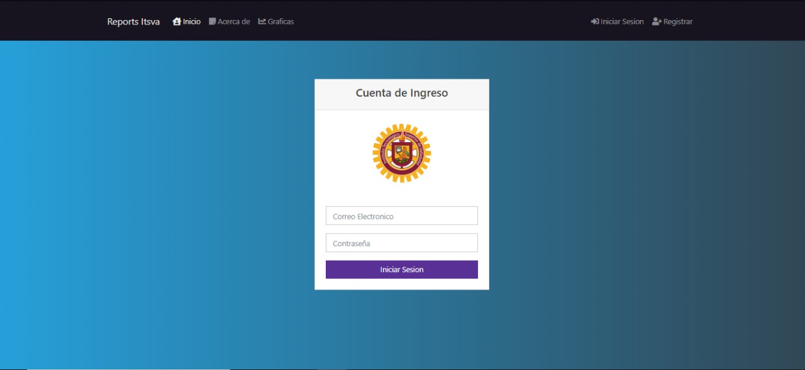
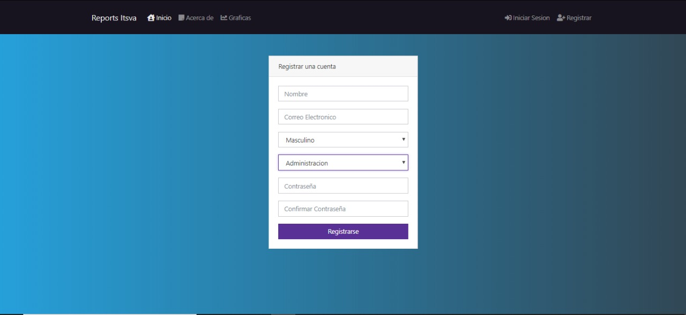
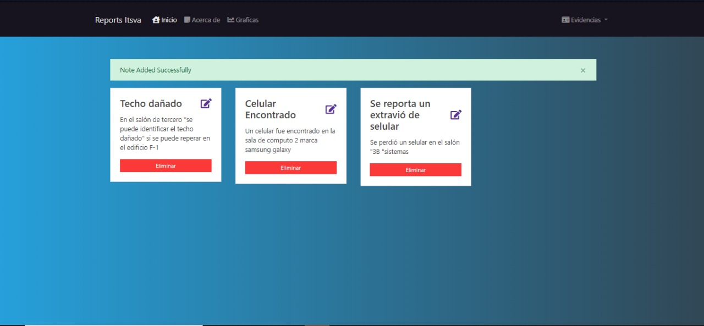
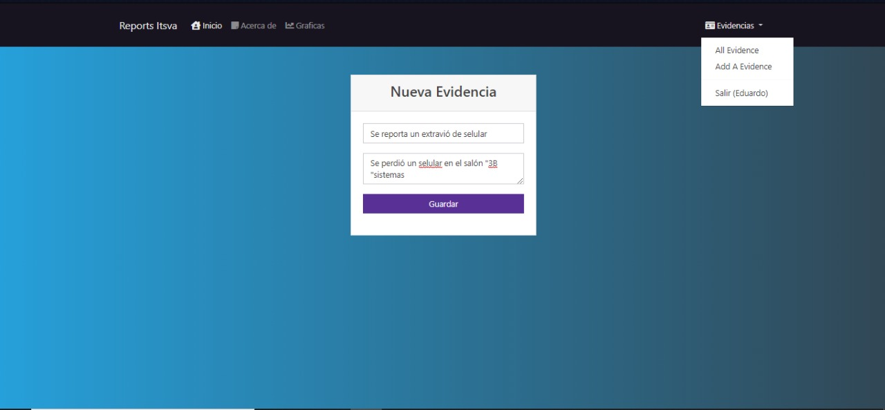
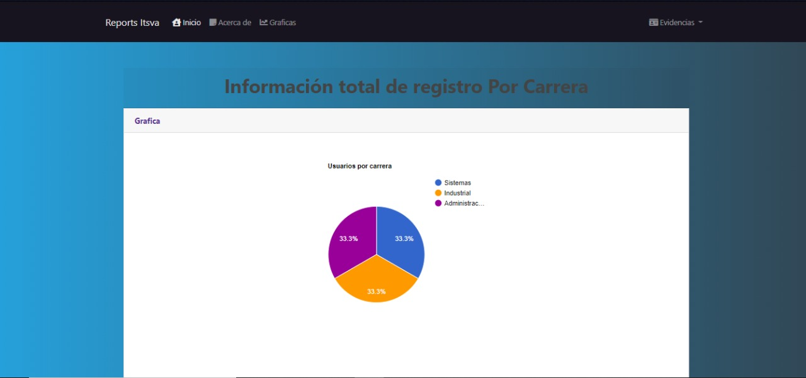
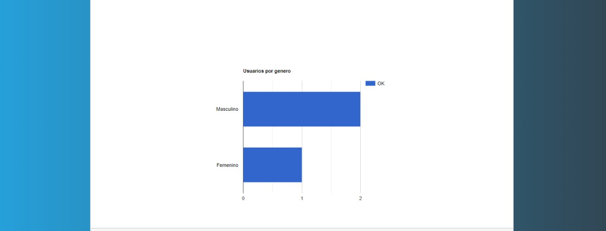
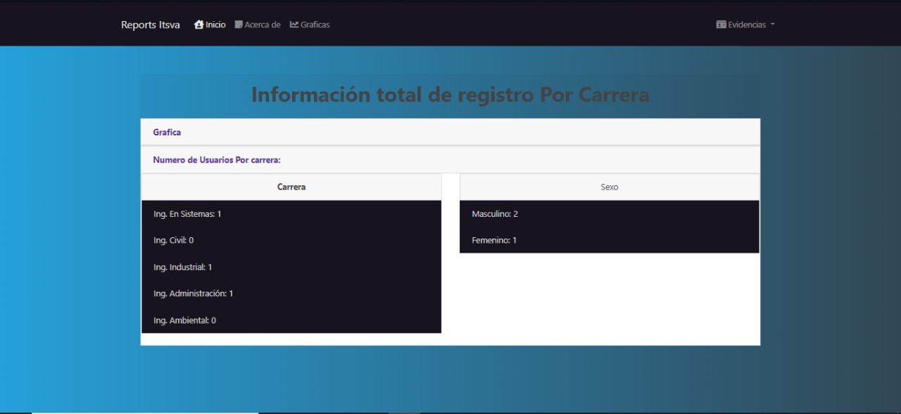

# Aplicacione Reali zado Con Node.JS, Mongodb

- create/read/update/delete Evidencia

# Screenshot Del Proyecto
- sign in

- sign up

- vista de las evidencias

- Para agregar una evidencia

- seccion para ver el numero de estudiantes en la plataforma

- grafica por Genero

- numero de estudiantes por carrera 

# Integrantes de equipo
* Eduardo Emanuel Un Suaste
* Ricardo Che Cauich
* Marcelino Canche Tun