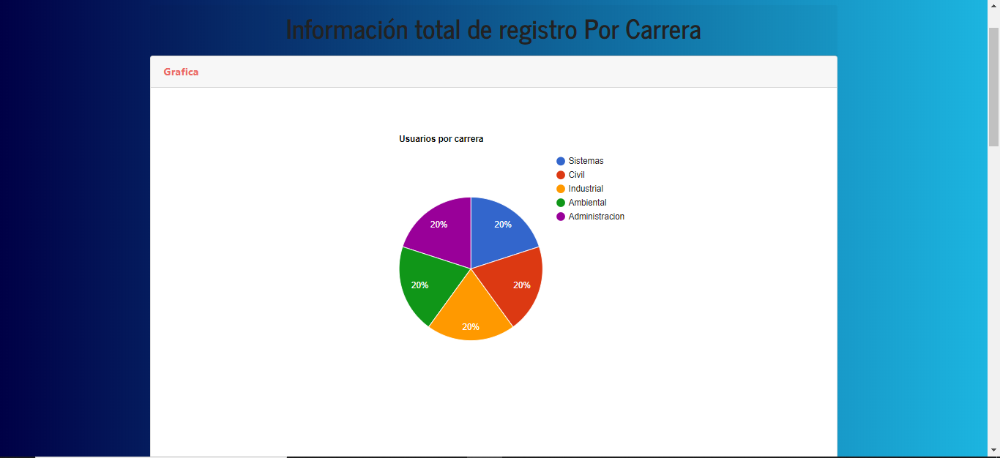

# Aplicacione Reali zado Con Node.JS, Mongodb

- create/read/update/delete Evidencia

# Screenshot Del Proyecto
- sign in

- sign up

- Inicio del usuario para crear Evidencias

- vista de las evidencias

- Para agregar una evidencia

- seccion para ver el numero de estudiantes por carrera

- grafica por Genero

- numero de usuarios y total de evidencias

- Usuarios por Semestre

- Total de Usuarios por carrera

- Informacion del Usuario

PerfilUser.PNG
# Integrantes de equipo
* Eduardo Emanuel Un Suaste
* Ricardo Che Cauich
* Marcelino Canche Tun